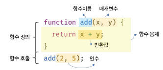
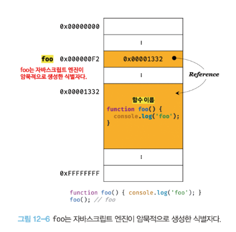
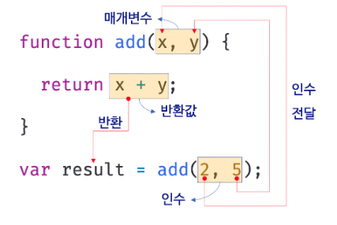
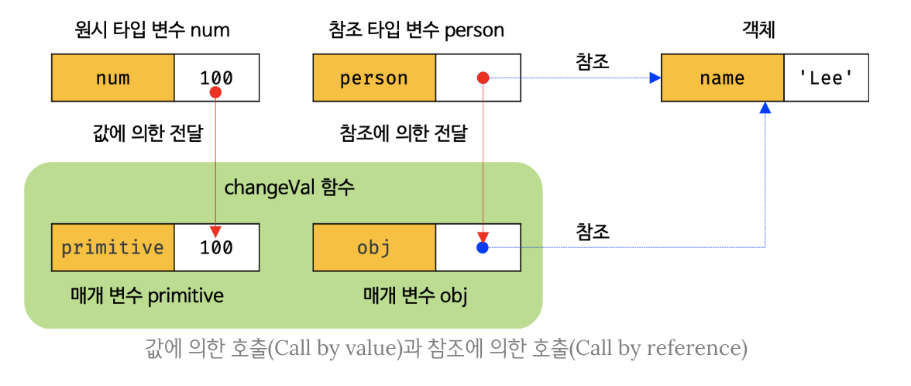

# 12장 함수
---

## 12.1 함수란?
>프로그래밍 언어의 함수는 일련의 과정을 문으로 구현하고 코드 블럭으로 감싸서 하나의 실행 단위로 정의한 것



## 12.2 함수를 사용하는 이유
- 동일한 작업으로 반복적으로 수행 -> **코드의 재사용**
- **유지보수의 편의성**
- 실수를 줄여 **코드의 신뢰성** 향상
- 적절한 함수 이름을 통한 **코드의 가독성**

## 12.3 함수 리터럴
- 함수 리터럴은 `function` 키워드, `함수 이름`, `매개변수 목록`, `함수 몸체`로 구성
  - **함수 이름**
    - 함수 이름은 식별자 -> 식별자 네이밍 규칙 준수
    - 함수 이름은 함수 몸체 내에서만 참조할 수 있는 식별자
    - 함수 이름은 생략 가능 (기명함수, 무명/익명 함수)
  - **매개변수 목록**
    - 0개 이상의 매개변수를 소괄호로 감싸고 쉼표로 구분
    - 각 매개변수에는 함수를 호출할 때 지정한 인수가 순서대로 할당됨
    - 매개변수는 몸체 내에서 변수와 동일하게 취급 -> 식별자 네이밍 규칙 준수
  - **함수 몸체**
    - 함수가 호출되었을 때 일괄적으로 실행될 문들을 하나의 실행 단위로 정의한 코드 블록
    - 함수 호출에 의해 실행
>함수는 객체이지만 일반 객체와 달리 호출 가능하다!!!


## 12.4 함수 정의

### 12.4.1 함수 선언문
```jsx
function add(x , y) {
    return x + y;
}
```
- 함수 선언문은 표현식이 아닌 문 (값으로 평가될 수 없는 문 -> 완료 값 `undefined`) => **변수에 할당 불가능**
- 함수 리터럴과 형태가 동일하나, **함수 이름 생략이 불가능**
  --> 기명 함수 리터럴과 함수 선언문은 형태가 동일
  --> 이와같은 중의적 코드는 코드의 문맥에 따라 해석이 달라짐
    ```jsx
    function foo() {console.log('foo');} // 함수 선언문으로 해석
    foo(); //foo

    (function bar() {console.log('bar');}) //함수 리터럴 표현식으로 해석
    bar(); // ReferenceError: bar is not defined
    ```
    - 자바 스크립트 엔진은 함수 선언문을 해석해 함수 객체를 생성
    - 생성된 함수를 호출하기 위해 **함수 이름과 동일한 이름의 식별자를 암묵적으로 생성하고, 거기에 함수 객체를 할당**
    - 
  
### 12.4.2 함수 표현식
>자바스크립트의 함수는 값의 성질을 갖는 객체, 즉 '일급 객체'이다.
```jsx
var add = function (x, y) {
    return x + y;
};

console.log(add(2, 5)); //7
```
- 함수 표현식의 함수 리터럴은 함수 이름을 생략하는 것이 일반적
- 자바스크립트 엔진이 함수 선언문의 함수 이름으로 식별자를 자동 생성하기 때문에, 함수 표현식과 유사하게 동작하는 듯 보이지만 **함수 선언문은 표현식이 아닌 문이고 함수 표현식은 표현식인 문**이다.

### 12.4.3 함수 생성 시점과 함수 호이스팅
```jsx
console.dir(add); // f add(x,y)
console.dir(sub); // undefined

console.log(add(2, 5)); // 7
console.log(sub(2, 5)); // TypeError: sub is not a function

function add(x, y) { //함수 선언문 -> 선언문 이전 호출 가능
    return x + y;
}

var sub = function (x, y) { //함수 표현식 -> 선언문 이전 호출 불가능
    return x - y;
}
```
- 함수 선언문으로 함수를 정의하면 런타임 이전에 함수 객체가 먼저 생성됨
- 자바스크립트 엔진은 함수 이름과 동일한 이름의 식별자를 암묵적으로 생성하고 생성된 함수 객체를 할당함
  => `함수 호이스팅` : 함수 선언문이 코드의 선두로 끌어 올려진 것처럼 동작하는 자스 고유의 특징
  vs `변수 호이스팅` : 식별자가 먼저 생성되는 건 맞지만 var로 선언된 변수는 undefined로 초기화 <-- 함수 표현식

### 12.4.4 Function 생성자 함수
```jsx
var add = new Fuction('x', 'y', 'return x + y');
```
- 함수 선언문이나 함수 표현식으로 생성한 함수와 다르게 동작 -> 지양하자

### 12.4.5 화살표 함수
```jsx
const add = (x, y) => x + y;
```
- ES6에 도입
- 항상 익명 함수로 정의
- 생성자 함수로 사용할 수 없으며 표현뿐 아니라 내부 동작 또한 간략화
- 추후 26장에서 자세히...

## 12.5 함수 호출
- 함수를 가리키는 `식별자`와 한 쌍의 소괄호()인 `함수 호출 연산자`로 호출
- 소괄호 내에는 0개 이상의 인수를 쉼표로 구분해서 나열
- 함수를 호출하면 현재의 실행 흐름을 중단하고 호출된 함수로 실행 흐름을 옮김

### 12.5.1 매개변수와 인수
- 함수를 실행하기 위해 필요한 값을 함수 외부에서 내부로 전달해야 할 때, `매개변수`를 통해 `인수`를 전달
  - 인수는 값으로 평가될 수 있는 표현식이어야 하며 함수 호출 시 지정
  - 매개변수는 함수를 정의할 때 선언하며 함수 몸체 내부에서 변수와 동일하게 취급
- 함수는 매개변수의 개수와 인수의 개수가 일치하는지 체크 X 
  - 인수가 적으면 인수가 할당되지 않은 매개변수의 값은 undefined
  - 인수가 넘치면 초과된 인수는 무시 (arguments 객체의 프로퍼티로 보관)


### 12.5.2 인수 확인
- 함수를 정의할 때 적절한 인수가 전달되었는지 확인할 필요가 있다
    ```jsx
    function add(x, y) {
        if (typeof x !== 'number' || typeof y !== 'number')
            throw new TypeError('인수는 모두 숫자여야 합니다');
        return x + y;
    }
    ```
- 인수의 개수는 arguments 객체를 통해 확인
- 인수가 전달되지 않은 경우 단축 평가를 사용해 기본값 할당 `a = a || 0`
  - es6 에서 도입된 매개변수 기본값 사용도 가능

### 12.5.3 매개변수의 최대 개수
- 명시적인 제한은 없지만 최대 3개 이상을 넘지 않는 것을 권장
  - 만약 그 이상이 필요하면 객체를 인수로 전달 -> 순서도 신경 안써도 된다는 장점~

### 12.5.4 반환문
- 함수는 `return 키워드와 표현식(반환값)으로 이뤄진 반환문`을 사용해 실행 결과를 함수 외부로 반환할 수 있다
- 반환문의 두 가지 역할
  1. 함수의 실행을 중단하고 함수 몸체를 빠져나간다
  2. return 키워드 뒤에 오는 표현식을 평가해 반환한다 (명시적으로 지정하지 않으면 undefined)

## 12.6 참조에 의한 전달과 외부 상태의 변경
- 매개변수는 함수 몸체 내부에서 변수와 동일하게 취급 -> 타입에 따라 값에 의한 전달, 참조에 의한 전달 방식을 그대로 따름
```jsx
function changeVal(primitive, obj) {
    primitive += 100;
    obj.name = 'Kim';
}

var num = 100; //원시 값
var person = {name: 'Lee'}; //객체

changeVal(num, person);
console.log(num); //원시 값은 값 자체가 복사되어 매개변수에 전달되기 때문에 원본이 훼손되지 않는다
console.log(person); // 객체는 참조값이 복사되어 매개변수에 전달되므로 원본이 훼손된다
```


- 객체의 변경 추적 어려움을 해결하기 위한 방법으로는 `불변 객체`가 있음
  - 원시 값처럼 객체를 변경 불가능한 값으로 동작, 변경이 필요한 경우 방어적 복사를 통함

## 12.7 다양한 함수의 형태
