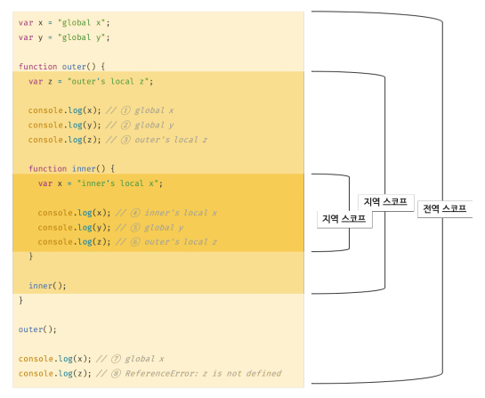

# 13장 스코프
---

## 13.1 스코프란?
- **모든 식별자는 자신이 선언된 위치에 의해 다른 코드가 식별자 자신을 참조할 수 있는 유효 범위가 결정된다.** 이 유효 범위를 `스코프`라고 한다.
- 결국 스코프는 **자바스크립트 엔진이 식별자를 검색할 때 사용하는 규칙**이다.
- 식별자는 유일한 값이어야 하지만, 스코프를 통해 식별자인 변수 이름의 충돌을 방지하여 같은 이름의 변수 사용이 가능하다.
- 단, `var` 키워드로 선언된 변수는 같은 스코프 내에서 중복 선언이 허용된다.

## 13.2 스코프의 종류
| 구분 | 설명                  | 스코프      | 변수      |
| ---- | --------------------- | ----------- | --------- |
| 전역 | 코드의 가장 바깥 영역 | 전역 스코프 | 전역 변수 |
| 지역 | 함수 몸체 내부        | 지역 스코프 | 지역 변수 |
- 전역 변수는 어디서든지 참조 가능
- 지역 변수는 자신의 지역 스코프와 하위 지역 스코프에서만 유효


## 13.3 스코프 체인
- `스코프 체인` : 스포크가 계층적으로 연결된 것
- 변수를 참조할 때 자바스크립트 엔진은 스코프 체인을 통해 변수를 참조하는 코드의 스코프에서 시작하여 상위 스코프 방향으로 이동하며 선언된 변수를 검색한다
>스코프 체인은 물리적인 실체로 존재함! 
  1. 자바스크립트 엔진은 코드를 실행하기에 앞서 `렐시컬 환경`을 생성
  2. 변수 선언이 실행되면 변수 식별자가 이 자료구조에 키로 등록
  3. 변수 할당이 일어나면 변수 식별자에 해당하는 값을 변경

### 13.3.1 스코프 체인에 의한 변수 검색
- 상위 스코프에서 유효한 변수는 하위 스코프에서 자유롭게 참조할 수 있지만 하위 스코프에서 유효한 변수를 상위 스코프에서 참조할 수 없다

### 13.3.2 스코프 체인에 의한 함수 검색
- 함수도 식별자에 할당되기 때문에 스코프를 갖는다
- 따라서 스코프는 결국 `식별자를 검색하는 규칙`

## 13.4 함수 레벨 스코프
- 코드 블록이 아닌 함수에 의해서만 지역 스코프가 생성된다
- `블록 레벨 스코프` : 모든 코드 블록(if, for, while, try/catch 등)이 지역 스코프를 만든다
- `함수 레벨 스코프` : var 키워드로 선언된 변수는 오로지 함수의 코드 블록(함수 몸체)만을 지역 스코프로 인정한다
 ```jsx
 var i = 10;

 for (var i = 0; i <5; i++) {
    console.log(i); // 0 1 2 3 4
 }

 console.log(i); // 5 -> 의도치 않게 변수의 값이 변경되었음
 ```

## 13.5 렉시컬 스코프
- `동적 스코프` : **함수를 어디서 호출했는지**에 따라 함수의 상위 스코프를 결정
- `렉시컬 스코프(정적 스코프)` : **함수를 어디서 정의했는지**에 따라 함수의 상위 스코프를 결정
  - 자바스크립트는 렉시컬 스코프를 따름 -> 함수가 호출된 위치는 상위 스코프 결정에 어떠한 영향도 주지 않는다
  - 함수의 상위 스코프는 함수 정의가 실행될 때 정적으로 결정된다