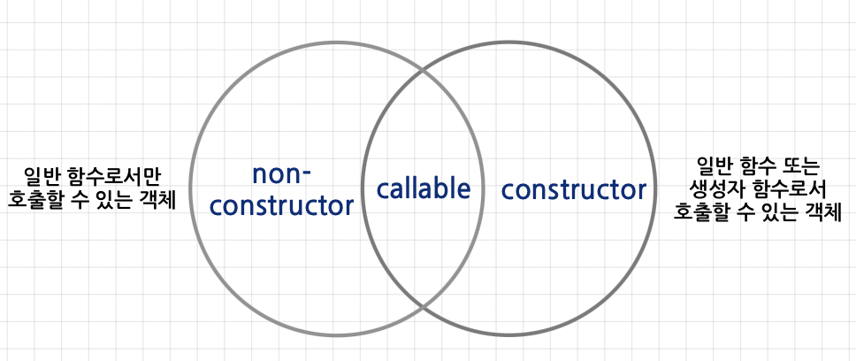

# 17장 생성자 함수에 의한 객체 생성
---

## 17.1 Object 생성자 함수
- `new` 연산자와 함께 `Object` 생성자 함수를 호출하면 빈 객체를 생성하여 반환한다. (이때, 생성자 함수에 의해 생성된 객체가 `인스턴스`)
- 이후 프로퍼티 또는 메서드를 추가하여 객체를 완성할 수 있다.
```jsx
const person = new Object();
person.name = 'Lee';
person.sayHello = function () {
    console.log('Hi! My name is ' + this.name);
};
```

## 17.2 생성자 함수

### 17.2.1 객체 리터럴에 의한 객체 생성 방식의 문제점
- 직관적이고 간편하지만 단 하나의 객체만 생성하기 때문에 동일한 프로퍼티를 갖는 객체를 여러 개 생성해야 하는 경우 비효율적이다.
- 프로퍼티는 객체마다 프로퍼티 값이 다를 수 있지만 메서드는 내용이 동일한 경우가 일반적이다.

### 17.2.2 생성자 함수에 의한 객체 생성 방식의 장점
- 객체(인스턴스)를 생성하기 위한 템플릿(클래스)처럼 프로퍼티 구조가 동일한 객체 여러 개를 간편하게 생성할 수 있다.
- new 연산자와 함께 호출하면 해당 함수는 생성자 함수로 동작한다.
  - new 없이 함수를 호출할 경우 일반 함수로 동작한다.
```jsx
function Circle(radius) {
    this.radius = radius;
    this.getDiameter = function () {
        return 2 * this.radius;
    };
}

const circle1 = new Circle(5);
const circle2 = new Circle(10);
```

### 17.2.3 생성자 함수의 인스턴스 생성 과정
- 자바스크립트 엔진은 암묵적인 처리를 통해 인스턴스를 생성하고 반환한다. 구체적인 과정은 다음과 같다.
  1. 빈 객체(인스턴스) 생성과 this 바인딩 <-- 런타임 이전에 실행
  2. 인스턴스 초기화 (필수 X)
        - 생성자 함수에 기술되어 있는 함수가 한 줄씩 실행되어 this에 바인딩되어 있는 인스턴스를 초기화
  3. 인스턴스 반환
        - 생성자 함수 내부에서 모든 처리가 끝나면 완성된 인스턴스가 바인딩된 this를 암묵적으로 반환
>생성자 함수 내부에서 명시적으로 this가 아닌 다른 값을 바환하는 것은 생성자 함수의 기본 동작을 훼손하므로 반드시 return 문은 생략해야 한다!!

### 17.2.4 내부 메서드 \[[Call]]과 \[[Construct]]
- 일반 객체와 달리 호출이 가능한 함수는 일반 객체가 가지고 있는 내부 슬롯과 내부 메서드는 물론, 함수로서 동작하기 위해 함수 객체만을 위한 `[[Environment]]`, `[[FormalParameters]]` 등의 내부 슬롯과 `[[Call]]`, `[[Construct]]` 같은 내부 메서드를 추가로 가진다.
```jsx
function foo() {}
foo(); //일반적인 함수로 호출 -> [[Call]] 호출 => callable
new foo(); //생성자 함수로 호출 -> [[Construct]] 호출 => constructor
```


### 17.2.5 constructor와 non-constructor의 구분
- 자바스크립트 엔진은 함수 정의를 평가하여 함수 객체를 생성할 때 함수 정의 방식에 따라 함수를 구분한다
  - `constructor` : 함수 선언문, 함수 표현식, 클래스
  - `non-constructor` : 메서드(ES6 메서드 축약 표현), 화살표 함수
>일반 함수(callable이면서 constructor)에 new 연산자를 붙이면 생성자 함수처럼 동작할 수 있음에 유의하자!!

### 17.2.6 new 연산자
- new 연산자와 함께 함수를 호출하면 해당 함수는 생성자 함수로 동작한다.
  - 이때, 호출하는 함수는 non-constructor가 아닌 constructor여야 한다.
- 반대로 new 연산자 없이 생성자 함수를 호출하면 일반 함수로 호출된다.
- 둘을 구분하기 위해 일반적으로 생성자 함수는 첫 문자를 대문자로 명명한다.

### 17.2.7 new.target (메타 프로퍼티)
- 함수 내부에서 new.target을 사용하면 생성자 함수로서 호출되었는지 확인할 수 있다.
  - `if (true) {new.target == 함수 자신}`
  - `else {new.target == undefined}`
```jsx
function Circle(radius) {
    if (!new.target) {
        return new Circle(radius);
    }

    this.radius = radius;
    this.getDiameter = function() {
        return 2 * this.radius;
    };
}

//new 연산자 없이 생성자 함수를 호출해도 new.target을 통해 생성자 함수로서 호출된다.
const circle = Circle(5);
```