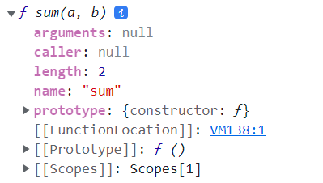

# 18장 함수와 일급 객체
---

## 18.1 일급 객체
- 다음과 같은 조건을 만족하는 객체를 `일급 객체`라 한다.
  1. 무명의 리터럴로 생성할 수 있다. 즉, 런타임에 생성이 가능하다.
  2. 변수나 자료구조(객체, 배열 등)에 저장할 수 있다.
  3. 함수의 매개변수에 전달할 수 있다.
  4. 함수의 반환값으로 사용할 수 있다
>자바스크립트의 함수는 위의 조건을 모두 만족하므로 일급 객체다!

  [[그렇다면 함수와 일반 객체의 차이점은?]]
  : 호출 가능 & 함수 고유의 프로퍼티를 소유

## 18.2 함수 객체의 프로퍼티


### 18.2.1 arguments 프로퍼티
- arguments 프로퍼티의 값은 arguments 객체, 프로퍼티의 키는 인수의 순서
  - 함수 호출 시 전달된 인수들의 정보를 담고 있는 순회 가능한 유사 배열 객체
  - 함수 내부에서 지역 변수처럼 사용 --> 외부에서 참조 불가
  - `callee` 프로퍼티 : 객체를 생성한 함수, 즉 함수 자신
  - `length` 프로퍼티 : 인수의 개수 => 가변 인자 함수 구현시 유용

### 18.2.2 caller 프로퍼티
- ~~비표준이라 몰라도 됨 ㅎ 함수 자신을 호출한 함수를 가리킨다.~~

### 18.2.3 length 프로퍼티
- 함수를 정의할 때 선언한 **매개변수**의 개수 (인자랑 헷갈리지 말자!)

### 18.2.4 name 프로퍼티
- 함수 이름

### 18.2.5 __proto__ 접근자 프로퍼티
- `[[Prototype]]` 내부 슬롯이 가리키는 프로토타입 객체에 접근하기 위해 사용하는 접근자 프로퍼티
```jsx
const obj = {a: 1};

console.log(obj.__proto__ === Object.prototype); // true

console.log(obj.hasOwnProperty('a')); //true
console.log(obj.hasOwnProperty('__proto__')) //false -> 상속받은 프로퍼티의 키는 false를 반환
```

### 18.2.6 prototype 프로퍼티
- 함수가 객체를 생성하는 생성자 함수로 호출될 때 생성자 함수가 생성할 인스턴스의 프로토타입 객체를 가리킨다. -> `constructor`만이 소유