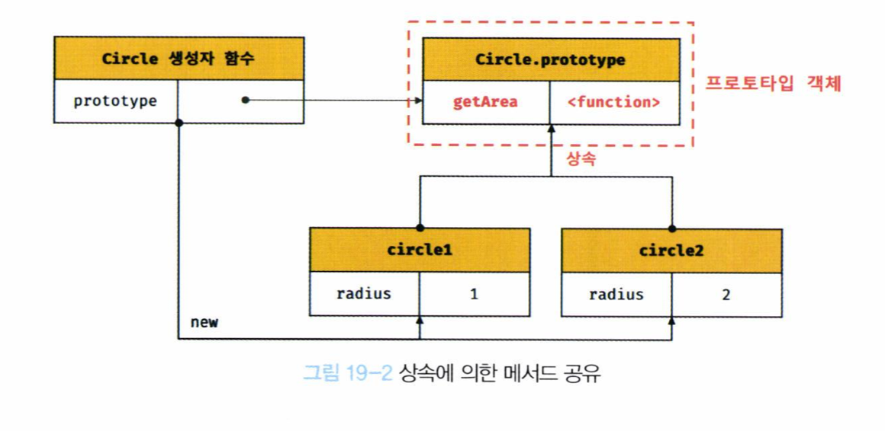

# 19장 프로토타입
>자바스크립트는 명령형, 함수형, 프로토타입 기반 객체지향 프로그래밍을 지원하는 멀티 패러다임 프로그래밍 언어이다.
---

## 19.1 객체지향 프로그래밍
>객체지향 프로그래밍은 프로그램을 명령어 또는 함수의 목록으로 보는 전통적인 명령형 프로그래밍의 절차지향적 관점에서 벗어나 여러 개의 독립적 단위, 즉 객체의 집합으로 프로그램을 표현하려는 프로그래밍 패러다임이다.
- 실체는 특징이나 성질을 나타내는 **속성**을 가지고 있고, 이를 통해 실체를 인식하거나 구별할 수 있다.
- 다양한 속성 중에서 프로그램에 필요한 속성만 간추려 내어 표현하는 것을 **추상화**라 한다.
- `객체`는 **속성을 통해 여러 개의 값을 하나의 단위로 구성한 복합적인 자료구조**이며, **상태 데이터와 동작을 하나의 논리적인 단위로 묶은 복합적인 자료구조**라고 할 수 있다.
- 각 객체는 고유의 기능을 갖는 독립적인 부품이면서 동시에 다른 객체와 관계성을 가질 수 있다.

## 19.2 상속과 프로토타입
- `상속`은 객체지향 프로그래밍의 핵심 개념으로, **어떤 객체의 프로퍼티 또는 메서드를 다른 객체가 상속받아 그대로 사용할 수 있는 것**을 말한다.
- 자바스크립트는 **프로토타입을 기반으로 상속을 구현하여 불필요한 중복을 제거**한다.
    ```jsx
    function Circle(radius) {
        this.radius = radius;
    }

    Circle.prototype.getArea = function () {
        return Math.PI * this.radius ** 2;
    }

    const circle1 = new Circle(1);
    const circle2 = new Circle(2);

    console.log(circle1.getArea === circle2.getArea); //true
    ```
    