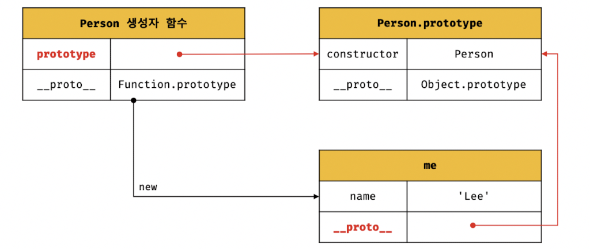
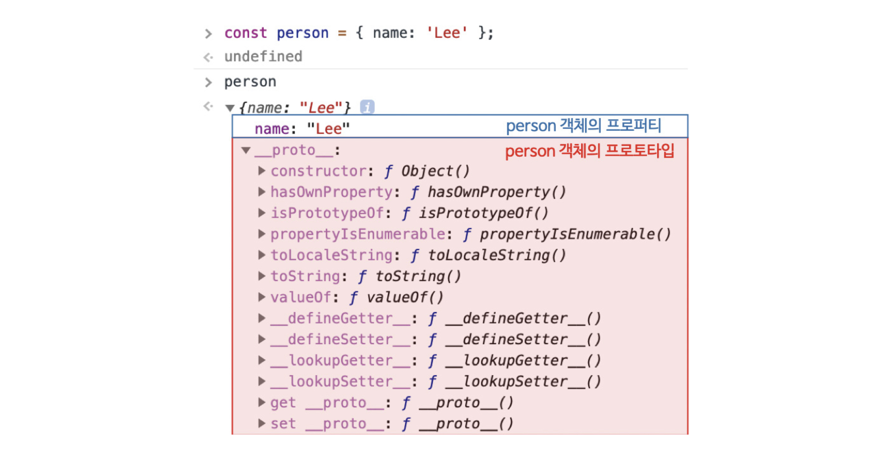
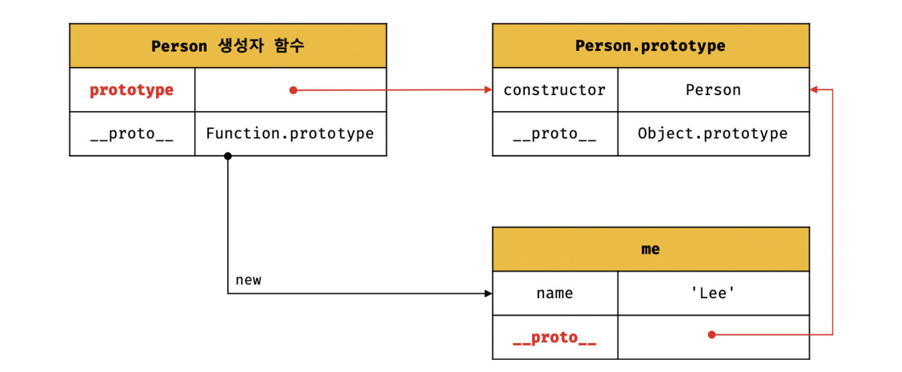
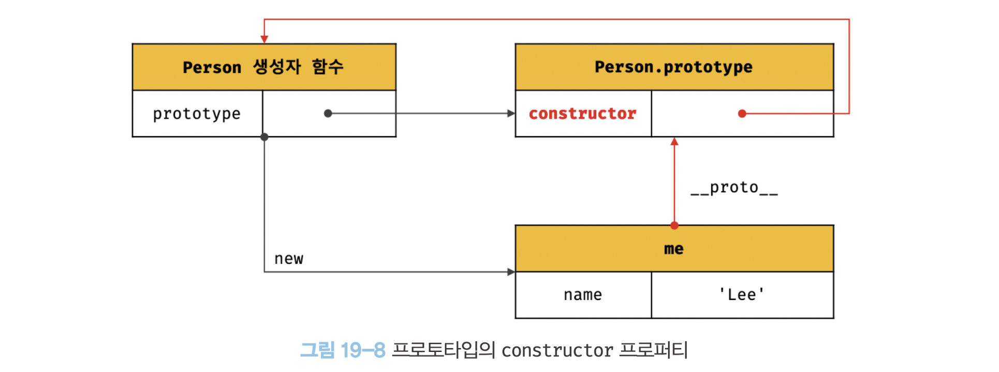

# 19장 프로토타입
>자바스크립트는 명령형, 함수형, 프로토타입 기반 객체지향 프로그래밍을 지원하는 멀티 패러다임 프로그래밍 언어이다.
---

## 19.1 객체지향 프로그래밍
>객체지향 프로그래밍은 프로그램을 명령어 또는 함수의 목록으로 보는 전통적인 명령형 프로그래밍의 절차지향적 관점에서 벗어나 여러 개의 독립적 단위, 즉 객체의 집합으로 프로그램을 표현하려는 프로그래밍 패러다임이다.
- 실체는 특징이나 성질을 나타내는 **속성**을 가지고 있고, 이를 통해 실체를 인식하거나 구별할 수 있다.
- 다양한 속성 중에서 프로그램에 필요한 속성만 간추려 내어 표현하는 것을 **추상화**라 한다.
- `객체`는 **속성을 통해 여러 개의 값을 하나의 단위로 구성한 복합적인 자료구조**이며, **상태 데이터와 동작을 하나의 논리적인 단위로 묶은 복합적인 자료구조**라고 할 수 있다.
- 각 객체는 고유의 기능을 갖는 독립적인 부품이면서 동시에 다른 객체와 관계성을 가질 수 있다.

## 19.2 상속과 프로토타입
- `상속`은 객체지향 프로그래밍의 핵심 개념으로, **어떤 객체의 프로퍼티 또는 메서드를 다른 객체가 상속받아 그대로 사용할 수 있는 것**을 말한다.
- 자바스크립트는 **프로토타입을 기반으로 상속을 구현하여 불필요한 중복을 제거**한다.
  - *객체마다 다른 값을 가지는 변수 말고 객체가 달라도 동일한 구조로 이루어진 함수를 프로토타입으로 따로 생성해 메모리 공간을 하나로 절약!!~*
    ```jsx
    function Circle(radius) {
        this.radius = radius;
    }

    Circle.prototype.getArea = function () {
        return Math.PI * this.radius ** 2;
    }

    const circle1 = new Circle(1);
    const circle2 = new Circle(2);

    console.log(circle1.getArea === circle2.getArea); //true
    ```
    

## 19.3 프로토타입 객체
>프로토타입은 어떤 객체의 상위 객체의 역할을 하는 객체로서 다른 객체에 공유 프로퍼티를 제공한다.
- 모든 객체는 \[[Prototype]]이라는 내부 슬롯을 가지며, \[[Prototype]]에 저장되는 프로토타입은 객체 생성 방식에 의해 결정된다.
    - 객체 리터럴에 의해 생성된 프로토타입 --> Object.prototype
    - 생성자 함수에 의해 생성된 프로토타입 --> prototype 프로퍼티에 바인딩되어 있는 객체
  


### 19.3.1 __proto__ 접근자 프로퍼티
>모든 객체는 \__proto__ 접근자 프로퍼티를 통해 자신의 프로토타입, 즉 \[[Prototype]] 내부 슬롯에 **간접적**으로 접근할 수 있다. 



- __proto__는 접근자 프로퍼티다.
    : Object.prototype의 접근자 프로퍼티인 __proto__는 getter/setter 함수라고 부르는 접근자 함수를 통해 \[[Prototype]] 내부 슬롯의 값, 즉 프로토타입을 취득하거나 할당한다.
    ```jsx
    const obj = {};
    const parent = { x: 1 };

    obj.__proto__; //getter 함수인 get __proto__가 호출되어 obj 객체의 포로토타입을 취득
    obj.__proto__ = parent; //setter 함수인 set __proto__가 호출되어 obj 객체의 프로토타입을 교체체
    
    ```
- __proto__는 접근자 프로퍼티는 상속을 통해 사용된다.
    : \__proto__ 접근자 프로퍼티는 객체가 직접 소유하는 프로퍼티가 아니라 Object.prototype의 프로퍼티다. 모든 객체는 상속을 통해 Object.prototype.\__proto__ 접근자 프로퍼티를 사용할 수 있다.
    ```jsx
    const person = { name: 'Lee' };

    // person 객체는 __proto__ 프로퍼티를 소유하지 않는다.
    console.log(person.hasOwnProperty('__proto__')); // false

    // __proto__ 프로퍼티는 모든 객체의 프로토타입 객체인 Object.prototype의 접근자 프로퍼티다.
    console.log(Object.getOwnPropertyDescriptor(Object.prtotype, '__proto__'));
    ```

- __proto__는 접근자 프로퍼티를 통해 프로토타입에 접근하는 이유
    : 프로토타입에 접근하기 위해 접근자 프로퍼티를 사용하는 이유는 `상호 참조에 의해 프로토타입 체인이 생성되는 것을 방지하기 위해서`다. (프로토타입 체인은 **단방향 링크드 리스트**로 구현되어야 한다)

- __proto__는 접근자 프로퍼티를 코드 내에서 직접 사용하는 것은 권장하지 않는다.
    : 모든 객체가 \__proto__ 접근자 프로퍼티를 사용할 수 있는 것은 아니기 때문이다.
    ```jsx
    // obj는 프로토타입 체인의 종점이다. 따라서 Object.__proto__를 상속받을 수 없다.
    const obj = Object.create(null);
    // obj는 Object.__proto__를 상속받을 수 없다.
    console.log(obj.__proto__); // undefined
    // 따라서 __proto__보다 Object.getPrototypeOf 메서드를 사용하는 편이 좋다.
    console.log(Object.getPrototypeOf(obj)); //null
    ```
    - 대신 프로토타입의 참조를 취득하고 싶은 경우에는 `Object.getPrototypeOf` 메서드를 사용하고, 프로토타입을 교체하고 싶은 경우에는 `Object.setPrototypeOf` 메서드를 사용할 것을 권장한다.

### 19.3.2 함수 객체의 prototype 프로퍼티
>함수 객체만이 소유하는 prototype 프로퍼티는 생성자 함수가 생성할 인스턴스의 프로토타입을 가리킨다.

| 구분                       | 소유        | 값                | 사용 주체   | 사용 목적                                                                    |
| -------------------------- | ----------- | ----------------- | ----------- | ---------------------------------------------------------------------------- |
| \__proto__ 접근자 프로퍼티 | 모든 객체   | 프로토타입의 참조 | 모든 객체   | 객체가 자신의 프로토타입에 접근 또는 교체하기 위해 사용                      |
| prototype 프로퍼티         | constructor | 프로토타입의 참조 | 생성자 함수 | 생성자 함수가 자신이 생성할 객체(인스턴스)의 프로토타입을 할당하기 위해 사용 |



### 19.3.3 프로토타입의 constructor 프로퍼티와 생성자 함수
>모든 프로토타입은 constructor 프로퍼티를 갖는다. 이 constructor 프로퍼티는 prototype 프로퍼티로 자신을 참조하고 있는 생성자 함수를 가리킨다. 이 연결은 생성자 함수가 생성될 때, 즉 함수 객체가 생성될 때 이뤄진다.



## 19.4 리터럴 표기법에 의해 생성된 객체의 생성자 함수와 프로토타입
- 객체 리터럴에 의해 생성된 객체는 Object 생성자 함수가 생성한 객체가 아니지만 결국 객체로서 동일한 특성을 가진다.
- **프로토타입과 생성자 함수는 단독으로 존재할 수 없고 언제나 쌍으로 존재**한다.

| 리터럴 표기법      | 생성자 함수 | 프로토타입         |
| ------------------ | ----------- | ------------------ |
| 객체 리터럴        | Object      | Object.prototype   |
| 함수 리터럴        | Function    | Function.prototype |
| 배열 리터럴        | Array       | Array.prototype    |
| 정규 표현식 리터럴 | RegExp      | RegExp.prototype   |

## 19.5 프로토타입의 생성 시점
- 모든 객체는 생성자 함수와 연결되어 있으며, **프로토타입은 생성자 함수가 생성되는 시점에 더불어 생성**된다.
  
### 19.5.1 사용자 정의 생성자 함수와 프로토타입 생성 시점
- 생성자 함수로서 호출할 수 있는 함수, 즉 **constructor는 함수 정의가 평가되어 함수 객체를 생성하는 시점에 프로토타입도 더불어 생성**된다.
  - 이때, 생성된 프로토타입의 프로토타입은 언제나 `Object.prototype`이다.
- 생성자 함수로서 호출할 수 없는 함수, 즉 non-constructor는 프로토타입이 생성되지 않는다.

### 19.5.2 빌트인 생성자 함수와 프로토타입 생성 시점
- **빌트인 생성자 함수도 빌트인 생성자 함수가 생성되는 시점, 즉 전역 객체가 생성되는 시점에 생성**된다.
  - 생성된 프로토타입은 빌트인 생성자 함수의 `prototype 프로퍼티`에 바인딩된다.
>이처럼 객체가 생성되기 이전에 생성자 함수와 프로토타입은 이미 객체화되어 존재한다. 이후 **생성자 함수 또는 리터럴 표기법으로 객체를 생성하면 프로토타입은 생성된 객체의 \[[Prototype]] 내부 슬롯에 할당**된다. 이로써 생성된 객체는 프로토타입을 상속받는다.


<!-- 여기 너무 어려워서 일단 패쓰.... -->
<!-- ## 19.6 객체 생성 방식과 프로토타입의 결정
### 19.6.1 객체 리터럴에 의해 생성된 객체의 프로토타입
### 19.6.2 Object 생성자 함수에 의해 생성된 객체의 프로토타입
### 19.6.3 생성자 함수에 의해 생성된 객체의 프로토타입

## 19.7 프로토타입 체인

## 19.8 오버라이딩과 프로퍼티 섀도잉

## 19.9 프로토타입의 교체
### 19.9.1 생성자 함수에 의한 프로토타입의 교체
### 19.9.2 인스턴스에 의한 프로토타입의 교체

## 19.10 instanceof 연산자 -->
