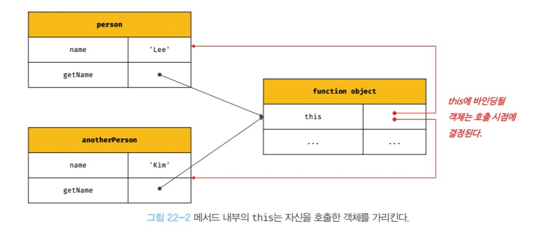
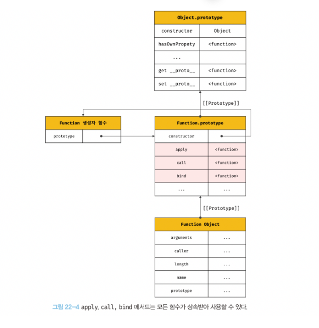

# 22장 this
---

## 22.1 this 키워드
>메서드가 자신이 속한 객체의 상태, 즉 프로퍼티를 참조하고 변경하려면 먼저 **자신이 속한 객체를 가리키는 식별자를 참조할 수 있어야 한다.**
- 객체 리터럴 방식으로 생성한 객체의 경우
    : getDiameter 메서드가 호출되는 시점에는 이미 객체 리터럴의 평가가 완료되어 객체가 생성되었고 circle 식별자에 생성된 객체가 할당된 이후이기 때문에 메서드 내부에서 circle 식별자를 참조할 수 있다!
- 생성자 함수 방식으로 인스턴스를 생성한 경우
    : 생성자 함수를 정의하는 시점에는 아직 인스턴스를 생성하기 이전이므로 생성자 함수가 생성할 인스턴스를 가리키는 식별자를 알 수 없다. 따라서 자신이 속한 객체 또는 자신이 생성할 인스턴스를 가리키는 특수한 식별자가 필요하다!

- **`this`는 자신이 속한 객체 또는 자신이 생성할 인스턴스를 가리키는 자기 참조 변수다.**
    - 자바스크립트 엔진에 의해 암묵적으로 생성되며, 코드 어디서든 참조할 수 있다.
    - this가 가리키는 값, 즉 [[this 바인딩은 함수 호출 방식에 의해 동적으로 결정]]된다. 
        <--> 자바나 c++ 같은 클래스 기반 언어에서 this는 언제나 클래스가 생성하는 인스턴스를 가리킨다.

```jsx
//this는 어디서든지 참조 가능하다.
//전역에서 this는 전역 객체 window를 가리킨다.
console.log(this); // window

function square(number) {
    //일반 함수 내부에서 this는 전역 객체 window를 가리킨다. (strict mode에서는 undefined)
    console.log(this); // window
    return number * number;
}
square(2);

const person = {
    name: 'Lee',
    getName() {
        // 메서드 내부에서 this는 메서드를 호출한 객체를 가리킨다.
        console.log(this); // {name: "Lee", getNmae: f}
        return this.name;
    }
};
console.log(person.getName()); // Lee

function Person(name) {
    this.name = name;
    // 생성자 함수 내부에서 this는 생성자 함수가 생성할 인스턴스를 가리킨다.
    console.log(this); // Person {name: "Lee"}
}

const me = new Person('Lee');
```


## 22.2 함수 호출 방식과 this 바인딩
>this 바인딩은 함수 호출 방식, 즉 함수가 어떻게 호출되었는지에 따라 동적으로 결정된다.

[[동일한 함수도 다양한 방식으로 호출할 수 있다]]
```jsx
const foo = function () {
    console.dir(this);
};

//1. 일반 함수 호출
//foo 함수를 일반적인 방식으로 호출
//foo 함수 내부의 this는 전역 객체 window를 가리킨다.
foo(); // window

//2. 메서드 호출
//foo 함수를 프로퍼티 값으로 할당하여 호출
//foo 함수 내부의 this는 메서드를 호출한 객체 obj를 가리킨다.
const obj = { foo };
obj.foo(); // obj

//3. 생성자 함수 호출
//foo 함수를 new 연산자와 함께 생성자 함수로 호출
//foo 함수 내부의 this는 생성자 함수가 생성한 인스턴스를 가리킨다.
new foo(); // foo {}

//4. Function.prototype.apply/call/bind 메서드에 의한 간접 호출
//foo 함수 내부의 this는 인수에 의해 결정된다.
const bar = { name: 'bar' };
foo.call(bar); // bar
foo.apply(bar); // bar
foo.bind(bar)(); // bar
```

### 22.2.1 일반 함수 호출
- 일반 함수로 호출된 모든 함수(중첩 함수, 콜백 함수 포함) 내부의 this에는 `전역 객체(global object)`가 바인딩된다.
    - 메서드 내부의 중첩 함수나 콜백 함수의 this 바인딩을 메서드의 this 바인딩과 일치시키기 위한 방법  
        1. this 바인딩을 변수에 할당
        2. 명시적으로 this를 바인딩
        3. 화살표 함수 내부의 this는 상위 스코프의 this를 가리킴
- strict mode가 적용된 일반 함수 내부의 this에는 `undefined`가 바인딩된다.

### 22.2.2 메서드 호출
- 메서드 내부의 this에는 메서드를 호출한 객체(마침표 연산자 앞에 기술한) 객체가 바인딩된다. --> *메서드를 소유한 객체가 아님에 유의하자!*
  

### 22.2.3 생성자 함수 호출
- 생성자 함수 내부의 this에는 생성자 함수가 (미래에) 생성할 인스턴스가 바인딩된다.
- new 연산자와 함께 호출하지 않으면 일반 함수로 동작함에 유의하자!

### 22.2.4 Function.prototype.apply/call/bind 메서드에 의한 간접 호출
-  apply, call, bind 메서드는 `Function.prototype`의 메서드 --> 모든 함수가 상속받아 사용할 수 있다!


- `apply`와 `call` 메서드는 함수를 호출하면서 첫 번째 인수로 전달한 특정 객체를 호출한 함수의 this에 바인딩한다.
  - `apply` 메서드는 호출할 함수의 인수를 배열로 묶어 전달
  - `call` 메서드는 호출할 함수의 인수를 쉼표로 구분한 리스트 형식으로 전달
  ```jsx
  function getThisBinding() {
    console.log(arguments);
    return this;
  }

  //this 로 사용할 객체
  const thisArg = { a: 1};

  //getThisBinding 함수를 호출하면서 인수로 전달한 객체를 getThisBinding 함수의 this에 바인딩한다.
  console.log(getThisBinding.apply(thisArg, [1, 2, 3]));
  //Arguments(3) [1, 2, 3, callee: f, Symbol(Symbol.iterater): f]
  // {a: 1}

  console.log(getThisBinding.call(thisArg, 1, 2, 3));
  //Arguments(3) [1, 2, 3, callee: f, Symbol(Symbol.iterater): f]
  // {a: 1}
  ```

- `bind` 메서드는 첫 번째 인수로 전달한 값으로 this 바인딩이 교체된 함수를 새롭게 생성해 반환한다.
  - 메서드의 this와 메서드 내부의 중첩 함수 또는 콜백 함수의 this를 일치시키기 위해 주로 사용된다.
    ```jsx
    const person = {
        name: 'Lee',
        foo(callback) {
            setTimeout(callback.bind(this), 100);
        }
    };

    person.foo(function () {
        console.log(`Hi! my name is ${this.name}.`);
    })
    ```

<br>


| 함수 호출 방식                                             | this 바인딩                            |
| ---------------------------------------------------------- | -------------------------------------- |
| 일반 함수 호출                                             | 전역 객체                              |
| 메서드 호출                                                | 메서드를 호출한 객체                   |
| 생성자 함수 호출                                           | 생성자 함수가 (미래에) 생성할 인스턴스 |
| Function.prototype.apply/call/bind 메서드에 의한 간접 호출 | 메서드에 첫 번째 인수로 전달한 객체    |